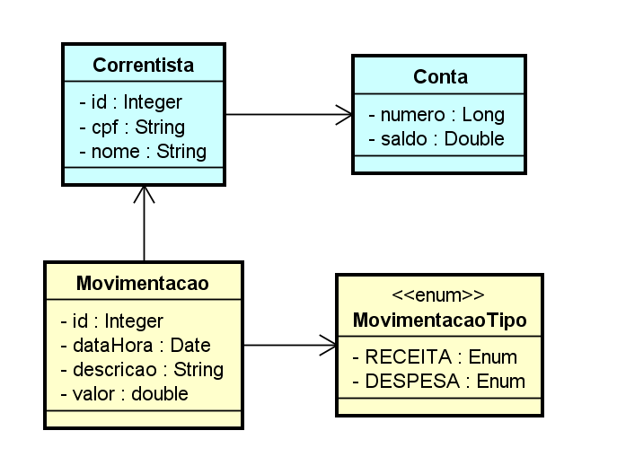
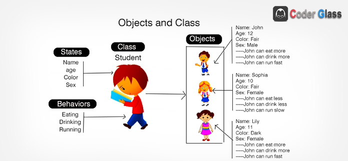

## Abstraindo o Domínio Bancário em Uma API REST com Java (Santander Dev Week)

## Arquitetura
O projeto será desenvolvido na arquitetura do Spring Framework + Springboot estruturado no padrão MVC 
para prover uma API REST para movimentações financeiras simples

- modelar e desenvolver uma API REST usando Java e Spring Boot.
- publicá-la na nuvem (Heroku), para que nossos clientes possam consumi-la através da Internet.

## Tecnologias

- Java JDK
- Intellijei IDE: Programa para edição, depuração, compilação, testes e execução de programas
- Hibernate: Framework baseado no conceito de ORM para a persistencia de dados em um banco
relacional;
- Spring Framework: plataforma para desenvolvimento de aplicações Java baseado nos padrões de projeto
de inversão de controle e injeção de dependencias;
- Postgres: Banco de dados relacional
- Swagger: ferramenta de documentação de APIS e Webservices
- Github: repositório e gerenciador de versionamento de código fonte;
- Maven: sistema para gestão de dependencias e distribuição de uma aplicação
- Heroku: Plataforma para hospedagem de aplicações com fácil integração com Github;
- REST: Arquitetura para transferencia de dados representativos com JSON
- POSTMAN:ompartilhar, testar e documentar APIs. Isso é feito, permitindo aos usuários criar e salvar solicitações 
HTTP e HTTPs simples e complexas, bem como ler suas respostas.

## Projeto

## POO

Em POO , um objeto é uma abstração do mundo real composto por um identificado(nome), atributos(propriedades) 
e métodos(comportamentos) definidos em uma classe.

**ExpressÕES utilizada no POO**

- Intanciar (new): ato de criar um novo objeto a partir de estrutura definida em uma classe
- Composrtamentos(behavior): conhecido como ações ou métodos, é toda parte comportamental que um objeto dispõe.
- Características (states): também conhecido como atributos ou propriedade, é toda informação que representa o estado do objeto
- Identificador (identity): propósito existencial aos objetos que serão criados (nome da classe);
- Classe(class): a estrutura e ou reperesentação que direciona a criação dos objetos de mesmo tipo, É o molde.

## Spring Frameqork é baseado em dois pilares

- Inversão de controle(Inversion of Controle ) ou IOC: trata-se do redirecionamento do fluxo de execução de um código 
retirando parcialmente o controle sobre ele e delegando-o para um container. O principal propósito é minimizar o acoplamento do 
código.

- Injeção de dependencia: é um padrão de desenvolvimento com a finalidade de manter baixo o nível de acoplamento entre módulos de
um sistema.

        - **Beans**: Objeto que é instanciado e criado pelo container, montado e gerenciado por um container através do princípio da inversão
        de controle
        - **Scopes**: é a abrangencia no qual determinado recurso é disponível.Controle da existencia de nossos objetos Components da aplicação em uma esfera de utilização:
        Singleton, Prototype, Request, Session, Global
        - **Autowired**: Um recurso em forma de anotação(indicação) onde deverá ocorrer uma injeção automática de dependência.

## Springboot

Enquanto o Spring Framework é baseado o padrão de injeção de dependências , O springboot(é um leque de componentes e 
funcionalidades em cima do spring framework ) foca na configuração automática.

## Startes
São dependencias que agrupam outras dependecias com um propósito em comum. Dessa forma, somente uma configuração é realizada 
no seu gerenciador de dependências no caso o Maven. Mas por baixo temos o spring framework gerenciando.

**Prinicpais Startes para dar andamento ao projeto**

- spring-boot-starter-*
- data-jpa: Integração ao banco de dados via JPA-Hibernate
- data-mongodb: Interação com banco de dados MongoDB;
- web: inclusão do container Tomcat para aplicações REST
- web-services: webservices baseados na arquitetura SOAP
- batch: Implementação de JOBs de processos( processo em lote em paralelo)
- test: disponibilização de recursos para testes unitários como JUnit
- openfeign: Client HTTP baseado em interfaces
- actuator: Gerenciamento de monitoramento da aplicação

## Obervação

- Usando a convenção do web Spring MVC , nós temos a camada de Controllers, onde vou disponibilizar as rotas 
 para que eu possa disponibilizar os nossos recursos e as pessoas interagirem na nossa aplicação

## Referencias

- [introducao](https://glysns.gitbook.io/java-full-stack/stack-java/introducao)
- [configurando docker](https://towardsdatascience.com/how-to-run-postgresql-and-pgadmin-using-docker-3a6a8ae918b5)
- [configurando docker](https://dev.to/devbaraus/postgresql-docker-5c3n)